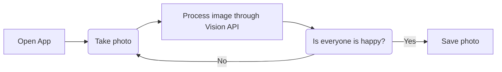

# only-happy-photos
An Android application using Google Cloud Vision API that only takes photos when everyone is happy.
 
## Introduction
Taking photos is very hard. Especially when it's for a group of people. If only there were an app that made sure everyone was smiling, so you don't have to! only-happy-photos is here to help!

### What is this?
only-happy-photos is an Android application that waits for everyone in a photo frame to be happy before taking a photo. The application takes a sequence of photos starting from when the user presses the capture button. These photos are then sent to Google Cloud's Vision API to determine if everyone in the photo is happy. If everyone is smiling, the photo is saved to the local device's photo gallery. If someone isn't ready for the photo, another photo is taken until everyone is smiling or the photographer gives up (and presses the end capture button).

### A flow chart

##
##### Made by Richard L. at CalHacks 6.0

